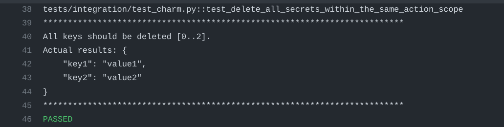

<!--
Avoid using this README file for information that is maintained or published elsewhere, e.g.:

* metadata.yaml > published on Charmhub
* documentation > published on (or linked to from) Charmhub
* detailed contribution guide > documentation or CONTRIBUTING.md

Use links instead.
-->

# secrets-test

Small demonstration of the unexpected beahvior observed when multiple changes (deletion) are applied on a multi-pack secret of a charm within the smae event context. 


## Description

Demonstration of the issue is visible in the correpsonding [Integration Test](tests/integration/test_charm.py).

NOTE: These tests are representing BROKEN behavior.

Running green means that the feature is still broken.


## How to use

Pipelines are equipped to run both on Juju 3.1. `edge` and `stable` releases.

Whenever a new Juju 3.1. `stable`/`edge` release may be out, you just have to re-run the pipelines to verify if previous issues still may hold.

We suggest to keep already existing tests --making sure that already working behavior is preserved-- and extend them with demonstrations of freshly broken characteristics.


## Pipelines

The demo is equipped with verbose pipelines, printing expected results vs. actual ones.

Furthermore, all `juju debug-logs` are also listed after each test run (in case curiousity about the details).

An example of how the demo can showing broken behavior, with a purposefully broken test:

```
for i in range(3):
    await helper_execute_action(ops_test, "set-secret", {"key": f"key{i}", "value": f"value{i}"})
await helper_execute_action(ops_test, "delete-secrets", {"keys": ["key{i}" for i in range(3)]})
secrets_data = await helper_execute_action(ops_test, "get-secrets")

[..<printout>..]

# ISSUE: This is NOT the intuitively expected behavior
assert secrets_data.get("secrets") == {"key2": "value2", "key3": "value3"}
```

Then, on the pipeline we'll see:



Alternatively of course it's also possible to show broken behavior with tests breaking, as "normal" :-)
